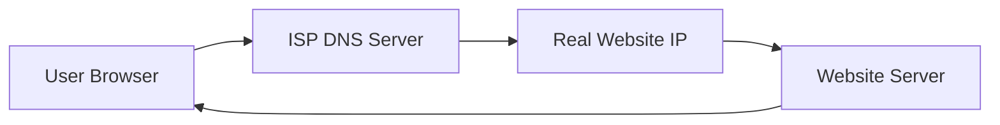
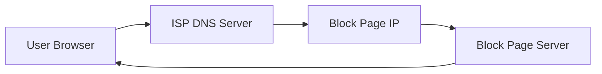

# 🚀 Bypass ISP Blocking – Change Your DNS


A simple guide to **bypass ISP DNS blocking** when a legitimate website is redirected to a government or ISP block page (for example `blocked.sbmd.cicc.gov.ph`).

This guide shows how to switch to **Cloudflare DNS (1.1.1.1)** so your device queries a **neutral DNS resolver instead of your ISP's DNS**.

---

# 📑 Table of Contents

- [Why DNS Blocking Happens](#why-dns-blocking-happens)
- [How DNS Resolution Works](#how-dns-resolution-works)
- [How ISPs Block Websites](#how-isps-block-websites)
- [How Public DNS Bypasses the Block](#how-public-dns-bypasses-the-block)
- [Change Your DNS](#change-your-dns)
- [Verify DNS](#verify-dns)
- [Troubleshooting](#troubleshooting)

---

# 🌐 Why DNS Blocking Happens

Your **Internet Service Provider (ISP)** controls the default DNS servers your device uses.

When regulators require a domain to be blocked, the ISP modifies its DNS server so that:

```
example.com → returns block page IP instead of real IP
```

Instead of sending you to the real server, you are redirected to a **government block page**.

---

# ⚙️ How DNS Resolution Works



**Normal DNS Flow**

1. Your browser asks the ISP DNS server for a domain.
2. DNS returns the correct IP address.
3. Your browser connects to the website.

---

# 🚫 How ISPs Block Websites



**DNS Blocking Flow**

1. You request the real website.
2. ISP DNS intercepts the request.
3. DNS returns the IP of the block page instead.

**Result:** You see the block notice instead of the real website.

---

# 🔓 How Public DNS Bypasses the Block

```mermaid
flowchart LR
    A[User Browser] --> G[Cloudflare DNS (1.1.1.1)]
    G --> C[Real Website IP]
    C --> D[Website Server]
    D --> A
```

**What Changes**
- Your device now asks Cloudflare DNS instead of your ISP DNS.
- The ISP no longer controls the domain resolution.

---

# 🛠 Change Your DNS

### Recommended DNS
**Cloudflare Public DNS**

```
Primary:    1.1.1.1
Secondary:  1.0.0.1
```

**Benefits:**
- ⚡ Very fast global DNS network
- 🔒 Privacy focused (no logging)
- 🌏 Works well in the Philippines

### 📱 Option 1 — Use the 1.1.1.1 App (Easiest)

**Android**  
[Download on Google Play](https://play.google.com/store/apps/details?id=com.cloudflare.onedotonedotonedotone)

**iOS**  
[Download on App Store](https://apps.apple.com/us/app/1-1-1-1-faster-internet/id1423538627)

**Steps:**
1. Install the app
2. Toggle **1.1.1.1** ON
3. (Optional) Enable **WARP** for extra privacy & speed

### 💻 Option 2 — Windows Manual Setup

1. Open **Control Panel** → **Network and Internet** → **Network and Sharing Center**
2. Click your connection → **Properties**
3. Select **Internet Protocol Version 4 (TCP/IPv4)** → **Properties**
4. Enter DNS:
   ```
   Preferred DNS: 1.1.1.1
   Alternate DNS: 1.0.0.1
   ```
5. Click OK
6. Flush DNS cache (run in Command Prompt as Administrator):
   ```
   ipconfig /flushdns
   ```

### 🍎 macOS Setup

1. Go to **System Settings** → **Network**
2. Select your connection → **Details…** → **DNS**
3. Add:
   ```
   1.1.1.1
   1.0.0.1
   ```
4. Flush cache (Terminal):
   ```
   sudo dscacheutil -flushcache; sudo killall -HUP mDNSResponder
   ```

### 🤖 Android Manual Setup (Wi-Fi)

1. **Settings** → **Network & internet** → **Wi-Fi**
2. Tap your network → **Edit** (pencil icon) → **Advanced**
3. Set **IP settings** to **Static**
4. Scroll down and enter:
   ```
   DNS 1: 1.1.1.1
   DNS 2: 1.0.0.1
   ```
5. Save

### 🍏 iOS Setup (Wi-Fi)

1. **Settings** → **Wi-Fi**
2. Tap the (i) next to your network
3. Scroll to **Configure DNS** → **Manual**
4. Add:
   ```
   1.1.1.1
   1.0.0.1
   ```

---

# ✅ Verify DNS

Open: [https://1.1.1.1/help](https://1.1.1.1/help)

You should see:
```
Using DNS over HTTPS (DoH): Yes
Using 1.1.1.1: Yes
```

Then test the previously blocked site, e.g.  
**https://trailblazerph.vercel.app**

---

# 🧰 Troubleshooting

If the site is **still blocked**:

**Possible causes:**
- ISP Deep Packet Inspection (DPI)
- Network firewall / router filtering
- Old DNS cache still active

**Solutions:**
- Restart your device and router
- Clear browser cache & cookies
- Enable **Cloudflare WARP** in the 1.1.1.1 app
- Use a full VPN as a last resort

---

# 📘 Educational Use

This repository explains how DNS infrastructure works and how users can select alternative DNS providers.  
It is intended **for educational purposes only**.

---

# 📅 Last Updated
March 2026

**Made with ❤️ for users in the Philippines facing ISP blocks**
